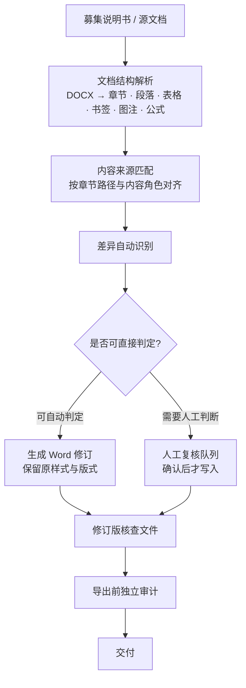

# Document Review Workbench

**债券业务核查分析文件自动化工作台**

> An automation workbench designed for bond underwriting document review workflows.
> It supports structured comparison, discrepancy detection, tracked-change generation and
> human-in-the-loop verification for compliance and review documents.

面向债券承销业务的核查分析文件自动化工作台。解决债券项目中**募集说明书、核查意见及分析文件**
在人工比对、定位、更新和修订环节耗时且易错的问题。


---

## 这个项目解决什么问题

债券项目里的核查分析文件，本质上是把**源文档**（募集说明书及其更新稿）的内容，
按章节和内容角色，逐条搬进**目标文档**（核查意见、分析文件），并保持 Word 的样式、编号、
交叉引用和修订痕迹。

人工做这件事的代价在于：

- 一份文件动辄上百个事项，逐条比对、定位、复制、改格式；
- 更新稿一来，之前做过的定位全部要重做一遍；
- 改动必须留下**可追溯的修订痕迹**，不能直接覆盖原文；
- 出错代价高，而"看一遍"这种复核方式并不可靠。

本工作台把「解析 → 匹配 → 差异识别 → 修订生成 → 人工确认 → 导出审计」做成一条可复核的流水线：
**能自动判定的直接生成修订，判不了的进入人工队列**，且人工确认的结果不会被程序自动写入文档。

## 处理流程



## 核心能力

| 能力 | 说明 |
|---|---|
| **文档结构解析** | 直接读写 OOXML：章节层级、段落、表格、书签、图注、Word 原生公式，不依赖任何第三方 Office 库 |
| **内容来源匹配** | 按章节路径与内容角色建立源文档到目标文档的对应关系，支持一对多与缺失事项 |
| **差异自动识别** | 识别内容差异、缺失事项、来源新增，按可判定程度分流 |
| **Word 修订模式生成** | 输出真正的 tracked changes（`w:ins` / `w:del`），保留原文档样式、编号与版式 |
| **人工确认工作流** | 不确定事项进入复核队列；**未确认的内容零写入**，误识别止步于 UI 层 |
| **导出前独立审计** | 交付前对输出文件做独立校验，导出结果与审计结论分离 |
| **版式保持与回归** | 布局策略 + golden layout 回归，防止修订引入版式漂移 |

## 技术栈

| 层 | 实现 |
|---|---|
| 运行时 | **Python 3.10+，零第三方依赖**（只用标准库） |
| 后端 | `http.server` ThreadingHTTPServer + `concurrent.futures` |
| 文档层 | 自研 OOXML 处理层（`zipfile` + `xml`）—— **不使用 python-docx** |
| 前端 | 原生 HTML / CSS / JavaScript，无框架、无构建步骤 |
| 测试 | `pytest`（开发期依赖，非运行时依赖） |

设计取向上刻意选择"零运行时依赖"：这是要被券商内网、离线机器、以及不愿装环境的人
双击就能跑起来的工具，装不上依赖就等于不可用。

## 测试与质量基线

```bash
pip install -r requirements-dev.txt
python -m pytest -q
```

```
282 passed, 23 skipped, 48 subtests passed
```

- 在**只装了 pytest 的干净虚拟环境**中复现通过，证明运行时确实零依赖。
- 跳过项为平台相关用例（Windows 路径语义、特定字体等），会在对应平台执行。
- 26 个测试文件，覆盖文档解析、来源匹配、修订写入、版式回归、导出审计、UI 复核流程等边界。

## 快速开始

运行时不需要安装任何依赖，只需 Python 3.10 或更新版本。

```bash
python start.py
```

或直接双击启动脚本：

| 平台 | 脚本 |
|---|---|
| macOS | `start_mac.command` |
| Windows | `start_windows.bat` |
| Linux | `start_linux.sh` |

服务只监听本机回环地址，文档不会离开这台机器。

## 项目结构

```
server.py                 HTTP 服务与 API 路由
start.py                  启动入口
workbench/
  engine.py                流程编排
  ingest.py                文档导入与来源校验
  docxio.py                OOXML 读写层
  matching.py              来源匹配
  plans.py                 修订计划生成
  source_policy.py         来源覆盖与策略
  missing_pipeline.py      缺失事项处理
  output_audit.py          导出前审计
  layout_policy.py         版式策略
tests/                     回归测试
web/                       前端（原生 JS）
tools/public_release_check.py   公开版脱敏自检
```

## 数据安全

本仓库是**脱敏后的公开版本**：只包含通用源码、算法与回归测试。
真实募集说明书、核查意见、分析文件、导出结果与运行日志一律不进入版本库，
相关目录已由 `.gitignore` 排除。正式部署版本与本公开仓库分开维护。

## 许可

本仓库当前未附开源许可证。公开可见不等于自动获得复制、修改与再分发许可。
如需复用，请先联系作者确认授权。
