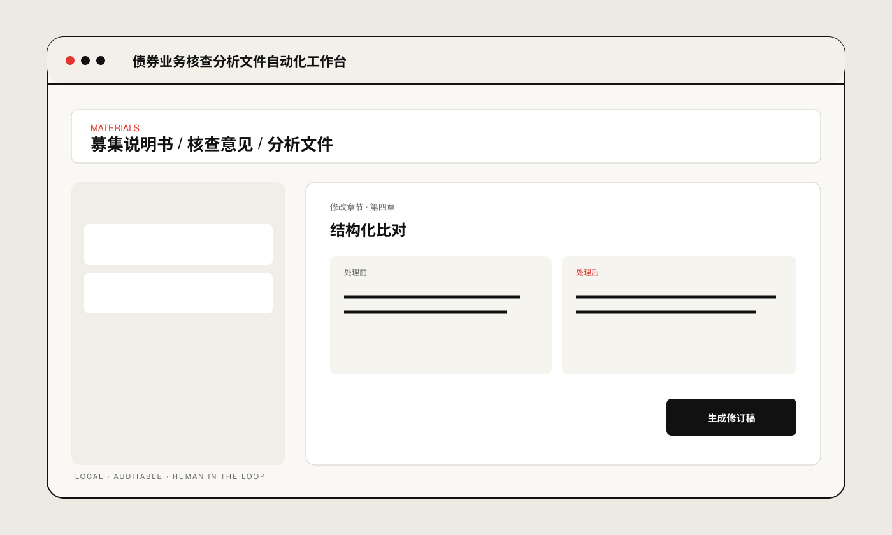
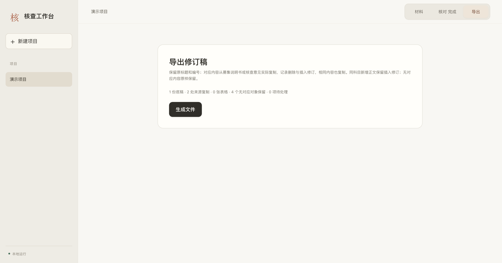

# Document Review Workbench

**债券业务核查分析文件自动化工作台**

A local workbench for bond underwriting document review, discrepancy detection and tracked-change generation.

## Preview

  
  

## Run locally

- macOS: `./start_mac.command`
- Windows: `start_windows.bat`
- Linux: `./start_linux.sh`

Public portfolio edition. No real client documents, production data or internal materials are included.
