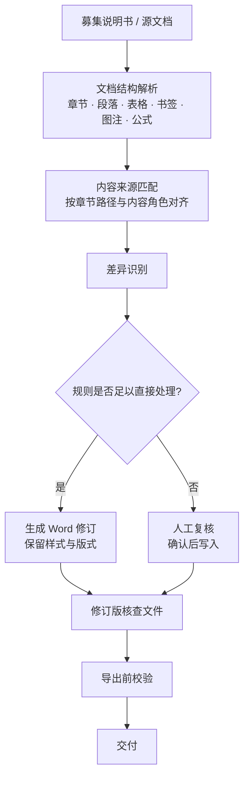

# Document Review Workbench

## 债券业务核查分析文件自动化工作台

> A local workbench for structured bond-underwriting document review, discrepancy detection, tracked-change generation and human review.

## 界面


> 截图使用虚构/合成数据，仅用于展示程序界面，不包含任何真实业务材料。

该工具用于债券承销项目中**募集说明书、核查意见和分析文件**之间的结构化核对与修订。系统按章节路径和内容角色建立来源映射，识别内容差异、缺失项和新增项，并将规则明确的事项生成 Word 修订；存在不确定性的事项进入人工复核。未确认事项不会写入输出文件，导出前另行执行完整性和版式校验。

## 核心能力

| 能力 | 说明 |
|---|---|
| **文档结构解析** | 直接读写 OOXML，处理章节层级、段落、表格、书签、图注和 Word 原生公式，不依赖第三方 Office 文档库 |
| **内容来源匹配** | 按章节路径与内容角色建立源文档和目标文档的对应关系，支持一对多映射与缺失事项识别 |
| **差异识别** | 识别内容变化、来源新增和目标缺失，并按规则可判定程度进行分流 |
| **Word 修订生成** | 输出原生 tracked changes（`w:ins` / `w:del`），尽量保留目标文档的样式、编号与版式 |
| **人工复核与导出校验** | 不确定事项进入人工复核；未确认内容不写入；导出前对输出文件进行独立校验 |

## 处理流程



## 技术实现

| 层 | 实现 |
|---|---|
| 运行时 | Python 3.10+；运行时仅使用标准库 |
| 服务层 | 基于 Python 标准库的本地 HTTP 服务，支持并发任务处理，仅监听本机地址 |
| 文档层 | 自研 OOXML 处理层（`zipfile` + `xml`），不使用 `python-docx` 作为运行时文档引擎 |
| 前端 | 原生 HTML / CSS / JavaScript，无前端框架和构建步骤 |
| 测试 | `pytest`，仅作为开发与验证依赖 |

运行时采用标准库实现，主要考虑内网、离线或受限环境中的部署稳定性，避免因额外依赖安装失败影响使用。

## 测试与质量基线

```bash
pip install -r requirements-dev.txt
python -m pytest -q
```

```text
282 passed, 23 skipped, 48 subtests passed
```

- 在仅安装 `pytest` 的干净虚拟环境中复现通过。
- 跳过项为平台相关用例，例如 Windows 路径语义和特定字体条件。
- 26 个测试文件覆盖文档解析、来源匹配、修订写入、版式回归、导出校验和人工复核流程等关键边界。

## 快速开始

```bash
python start.py
```

也可直接使用对应平台启动脚本：

| 平台 | 脚本 |
|---|---|
| macOS | `start_mac.command` |
| Windows | `start_windows.bat` |
| Linux | `start_linux.sh` |

服务仅监听本机回环地址（`127.0.0.1`），文档处理过程不依赖外部服务。

## 项目结构

```text
server.py                 HTTP 服务与 API 路由
start.py                  启动入口
workbench/
  engine.py               流程编排
  ingest.py               文档导入与来源校验
  docxio.py               OOXML 读写层
  matching.py             来源匹配
  plans.py                修订计划生成
  source_policy.py        来源策略
  missing_pipeline.py     缺失事项处理
  output_audit.py         导出前校验
  layout_policy.py        版式策略
tests/                    回归测试
web/                      前端
docs/                     界面截图
tools/
  public_release_check.py 公开版脱敏检查
```

## 数据安全

本仓库为公开展示版本，仅包含通用代码、算法实现和回归测试。实际业务中的募集说明书、核查意见、分析文件及运行数据不进入版本库，正式部署版本与公开仓库分开维护。

## 许可

本仓库当前未附开源许可证。公开可见不代表自动授予复制、修改或再分发权限；如需复用，请先联系作者确认授权。
